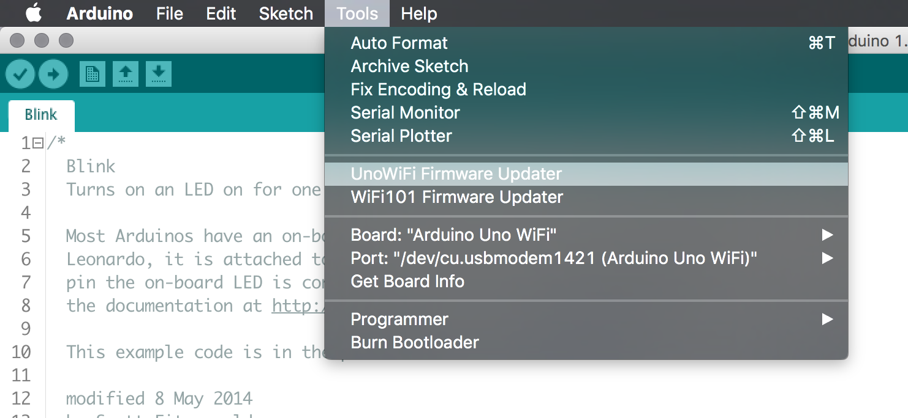
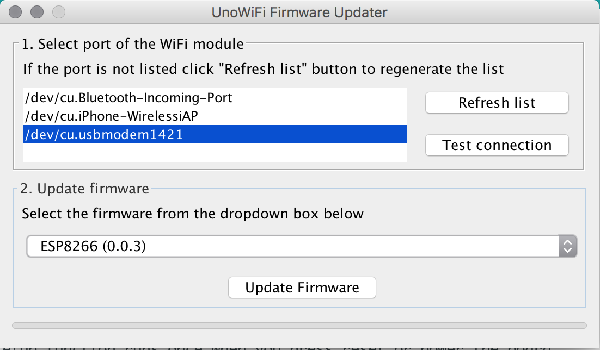
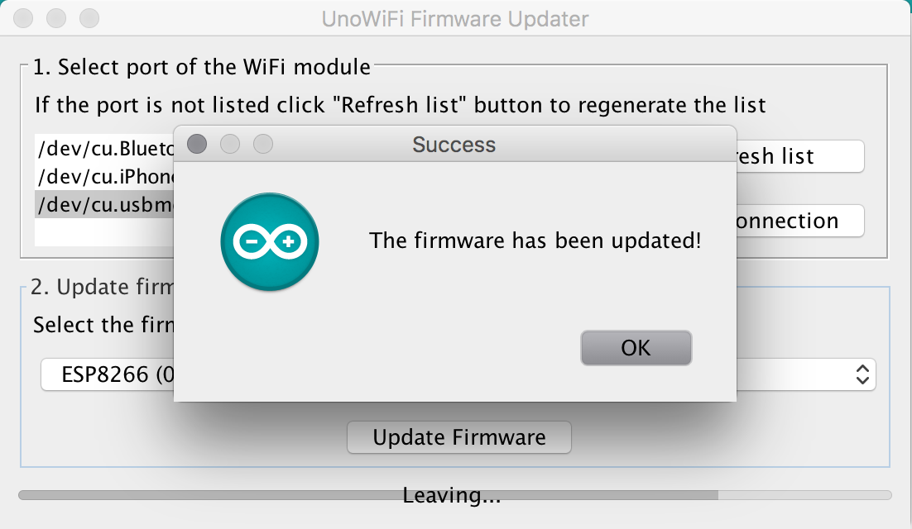

# Uno WiFi Firmware Updater Tool for Arduino IDE

This plugin is a GUI to update Firmware of the ESP8266 of the Uno WiFi Board.
This plugin will be bundled with the IDE starting from v.1.8.2

## Installation

- Download the tool [from this page](https://github.com/arduino-libraries/UnoWiFi-FirmwareUpdater-Plugin/releases/latest).
- Create a `tools` folder in your sketchbook, if it doesn't exist yet.
- Unpack the zip archive into `tools` folder (it will look like `.../Arduino/tools/UnoWiFi/tool/UnoWiFi.jar`)
- Restart the Arduino IDE.

## Usage

- Follow instructions [on this page](http://www.arduino.org/learning/tutorials/advanced-guides/arduino-uno-wifi-firmware-updater).

## Screenshots







## Issues and suggestions

Please open an issue [on github](https://github.com/arduino-libraries/WiFi101-FirmwareUpdater-Plugin/issues/new).

## Credits and license

This plugin is based on the WiFi101-FirmwareUpdater by Arduino LLC

```
 Copyright 2017 Arduino LLC (http://www.arduino.cc/)

 Arduino is free software; you can redistribute it and/or modify
 it under the terms of the GNU General Public License as published by
 the Free Software Foundation; either version 2 of the License, or
 (at your option) any later version.

 This program is distributed in the hope that it will be useful,
 but WITHOUT ANY WARRANTY; without even the implied warranty of
 MERCHANTABILITY or FITNESS FOR A PARTICULAR PURPOSE.  See the
 GNU General Public License for more details.

 You should have received a copy of the GNU General Public License
 along with this program; if not, write to the Free Software
 Foundation, Inc., 51 Franklin St, Fifth Floor, Boston, MA  02110-1301  USA

 As a special exception, you may use this file as part of a free software
 library without restriction.  Specifically, if other files instantiate
 templates or use macros or inline functions from this file, or you compile
 this file and link it with other files to produce an executable, this
 file does not by itself cause the resulting executable to be covered by
 the GNU General Public License.  This exception does not however
 invalidate any other reasons why the executable file might be covered by
 the GNU General Public License.
```
